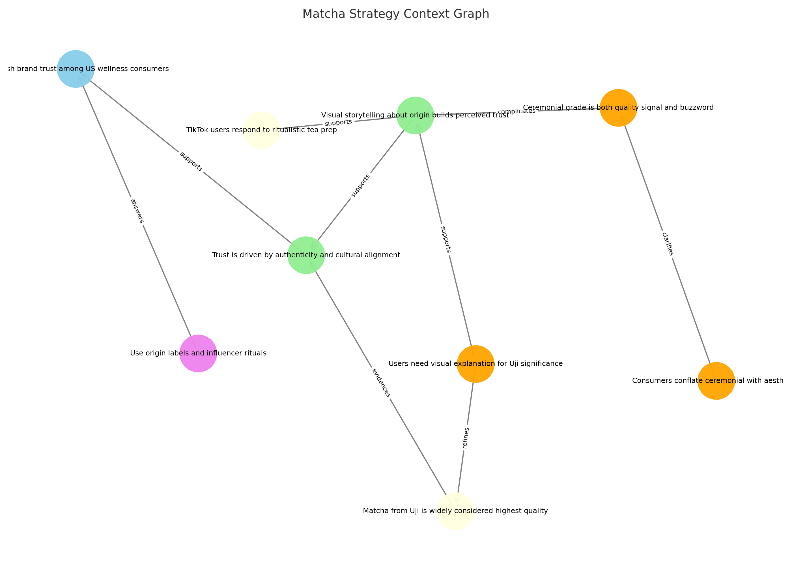

## ✅ Featured Module: Context Graph Construction

> Learn how to turn structured consulting-style reasoning into modular context graphs, usable by humans and LLMs alike.

🧠 Visual output:  

## 📂 Repo Structure

- `graphs/`: Visuals and rendering scripts
- `README.md`: Project overview and instructions
