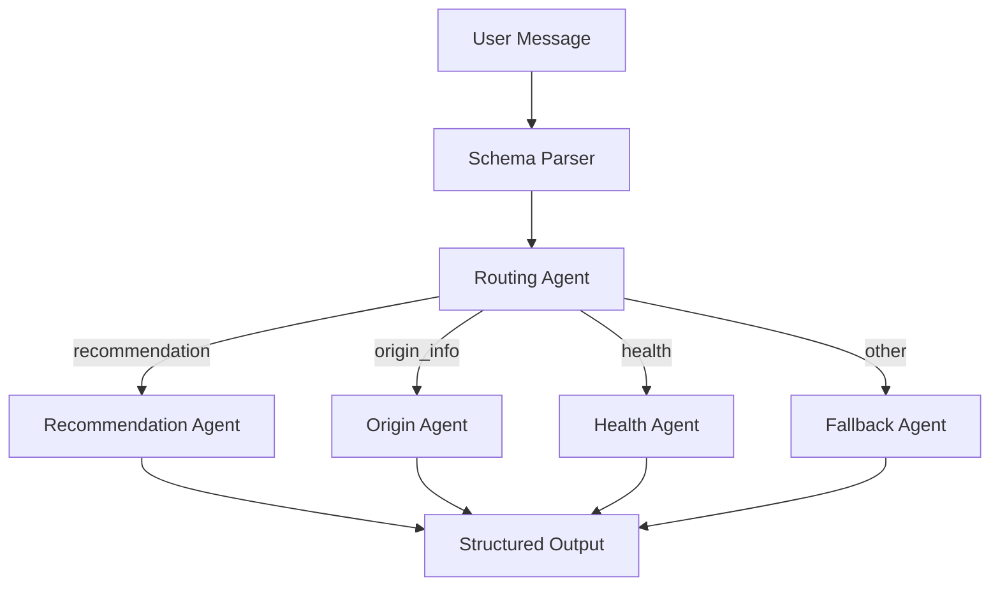

## Module 4: Agent Routing via Structured Context

> "This module is part of the Context Engineering Lab, a structured blueprint system for orchestrating LLM reasoning."

---

## 🎯 Module Goal
Establish an agent routing system driven by structured context, enabling an LLM to call the appropriate agent based on parsed contextual signals for multi-function, domain-specific tasks.

- 🌐 Input: Natural language
- 🧩 Parse: Structured schema (e.g., intent / use_case / flavor_profile)
- 🚦 Route: Dynamically dispatch agent based on context, not static rules
- 🧱 Architecture: Pluggable, composable, explainable routing logic

---

## 💡 Why Routing Agent Matters

Traditionally, agents are selected via hand-written rules like:
```python
if intent == "recommendation": call_agent_A()
elif intent == "origin_info": call_agent_B()
```

But we aim for:
> 🧠 “Let the context speak” — context-driven, LLM-enhanced orchestration

Benefits of a Routing Agent:
- Decides based on semantic structure, not keyword rules
- Allows fallback, chaining, and flexible behaviors
- Can be upgraded to LLM-based prompt routing or multi-agent composition

---

## 🛠️ Architecture Overview



---

## 🧪 Example Walkthrough

### User Input:
> "I want a gentle flavored Japanese matcha to drink in the evening."

### Step 1: Schema Parser Output
```json
{
  "intent": "recommendation",
  "use_case": "evening",
  "flavor_profile": "mild",
  "brand_preference": "Japanese"
}
```

### Step 2: Routing Agent Output
```json
{
  "agent_to_call": "recommendation_agent",
  "parameters": {
    "use_case": "evening",
    "flavor_profile": "mild",
    "brand_preference": "Japanese"
  }
}
```

### Step 3: Final Output
> "I recommend a mild flavored matcha from a Japanese brand for your evening moments."

---

## 📂 Code Highlights

### 🗂️ Sample `agent_registry.yaml`
```yaml
agents:
  recommendation:
    description: Recommend matcha based on flavor and use case
    class: recommendation_agent
  origin_info:
    description: Explain cultural origin of the matcha brand
    class: origin_agent
  health:
    description: Provide health benefits of matcha
    class: health_agent
```

### ⚙️ Example: Registry Loading in Python
```python
import yaml

# Load agent registry from config file
with open("agent_registry.yaml", "r") as f:
    registry = yaml.safe_load(f)["agents"]

# Dynamically get agent class by intent
intent = context["intent"]
agent_name = registry.get(intent, {}).get("class", "fallback_agent")
agent_fn = globals().get(agent_name)

# Call the selected agent
if agent_fn:
    result = agent_fn(context)
```

- This setup enables pluggable extension of new agents by updating YAML
- Makes agent orchestration declarative, not hard-coded

- Built using LangGraph `StateGraph` with state-passing and conditional routing
- Routing Agent is context-aware and outputs structured decision
- Three active agents (recommendation / origin / health)
- Easily extendable to more intents or task flows

---

## ⚡ Extension Plan

- 🧾 Create a config-based agent registry to decouple agent logic from routing code
  - Define agents and their supported `intent` in a YAML or JSON config
  - Dynamically load and invoke agents based on `intent` → `agent_name` mapping
  - Enables easier plugin architecture and declarative extension of new capabilities

- 🔄 Replace mock routing logic with LLM + OutputParser
- 🔍 Use semantic similarity or classifier for fuzzy routing
- 🔗 Combine multiple agents in pipeline (e.g., recommend + explain)
- 🧠 Integrate with memory and multi-turn planner

---

## 🔄 Integration with Module 1–3
| Module | Title | Integration Role |
|--------|-------|------------------|
| 1 | Structured Input Design | Defines input fields (intent, flavor, etc.) |
| 2 | Vector Search + Semantic Parsing | Can be used as the schema parser module (e.g., embedding-based intent parsing) |
| 3 | Evaluation Pipeline | Measures routing accuracy and reasoning trace |

---

## 🚀 What’s Next
This module transforms the context blueprint into an executable orchestration system. It sets the foundation for:

- Multilingual agent routing
- Domain-specific intelligent assistants (e.g., tourism, health, law)
- Persistent multi-agent planning with memory
- Visual config editor and semantic routing DSL

