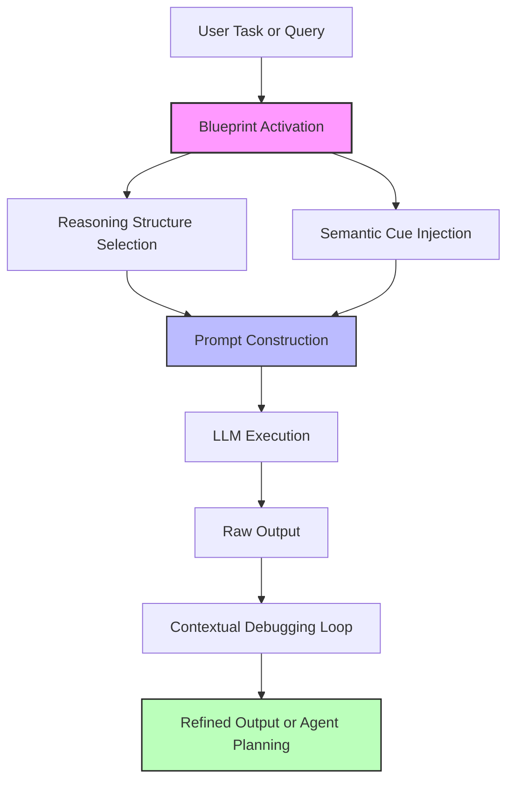

## Why Future AI Systems Need Context Engineers

### 🔍 Part 1: The Real Pain Points in Today’s LLM Systems

Most users assume that large language models (LLMs) generate thoughtful answers from scratch. But in reality, LLMs are **pattern completers**, not **thought initiators**.

#### Problem: Answer quality is often shallow or misaligned

- ❌ Prompt: "Analyze the reasons for this product's failure."
  - Output:
    - Vague generalities: pricing, branding, etc.
    - No surprising insights or deep reasoning

#### Root Cause: Lack of activated semantic paths

- LLMs rely on **token embeddings** to activate known reasoning patterns from training.
- Without **explicit triggers** (keywords, structure, cues), many valid thought paths remain dormant.
- Even if you ask the model to "reflect" or "consider alternatives," it won't escape its initial semantic cluster without clear cues.

#### Example: How structure transforms reasoning

Prompt A:

> "Analyze the reasons for the product's failure."

Prompt B:

> "Analyze from these angles: consumer psychology, regulatory policy, cultural interpretations, linguistic ambiguity. Then, suggest one overlooked factor."

🧪 In Prompt B, you’re embedding a blueprint of thought, which activates the model's memory in a much broader and more accurate way.

### 🔎 Part 2: Context Engineering ≠ Prompt Hacking

Most people see prompt engineering as crafting clever instructions. But truly powerful AI interaction comes from **Context Engineering**: the intentional design of input semantics, structure, and role to **ignite reasoning pathways**.

| Prompt Hacking                      | Context Engineering                                |
| ----------------------------------- | -------------------------------------------------- |
| Tweaks words for better phrasing    | Designs multi-layered reasoning structures         |
| Trial-and-error prompting           | Blueprint-driven interaction flows                 |
| Works at surface-level instructions | Works with latent task framing and intent modeling |

#### Context Engineers answer these:

- How to turn vague requests into structured reasoning chains?
- How to organize multi-source context into coherent semantic signals?
- How to manage agent systems with reasoning consistency?
- How to enable recall and recomposition in a traceable way?

---

### 💡 Part 3: Consulting & Coaching as Design Patterns

You can borrow proven human frameworks to design intelligent context scaffolds:

#### Consulting 4S Framework × Context Design

| Consulting 4S | Context Engineering Equivalent                      |
| ------------- | --------------------------------------------------- |
| State         | Frame ambiguous task, define intent & constraints   |
| Structure     | Build reasoning trees / task DAGs                   |
| Solve         | Route into modular execution plans (e.g. LangGraph) |
| Sell          | Format for human readability and strategic clarity  |

#### Coaching ≈ Orchestration Philosophy

Leadership coaching treats clients as whole and capable—not by giving answers but by activating latent insights.

That’s exactly how AI Orchestrators should treat Agents:

- Don’t micromanage. Design prompts that guide intention.
- Trust agents’ capabilities. Focus on **when** and **why** to call them.
- Ask powerful questions, not hard-coded commands.

### 🛋️ Part 4: A Blueprinted Orchestration Prototype

> **Consult-Orchestrator: A context-first planning system for AI workflows**

A LangGraph-based architecture where each module reflects a consulting principle:

- Applies to:
  - Structured generation tasks (e.g. longform, brainstorming)
  - Multi-agent planning (LangGraph, AutoGen)

---

### 📉 Part 5: What Do Context Engineers Actually Do?

| Core Role                     | Description                                     |
| ----------------------------- | ----------------------------------------------- |
| Semantic Scaffold Designer    | Design structure-aware prompts/templates        |
| Blueprint Activator           | Create reusable mental models and context trees |
| Contextual Debugger           | Analyze output quality and revise input path    |
| Agent Orchestration Architect | Build planner flows for agent interaction       |

---

### 🎯 Final Words

LLMs aren’t magic. They are potential-rich agents waiting for better framing.

**Context Engineering is how we unlock their intelligence.**

If prompt engineering is syntax, context engineering is syntax + semantics + orchestration.

Let’s build that layer.

